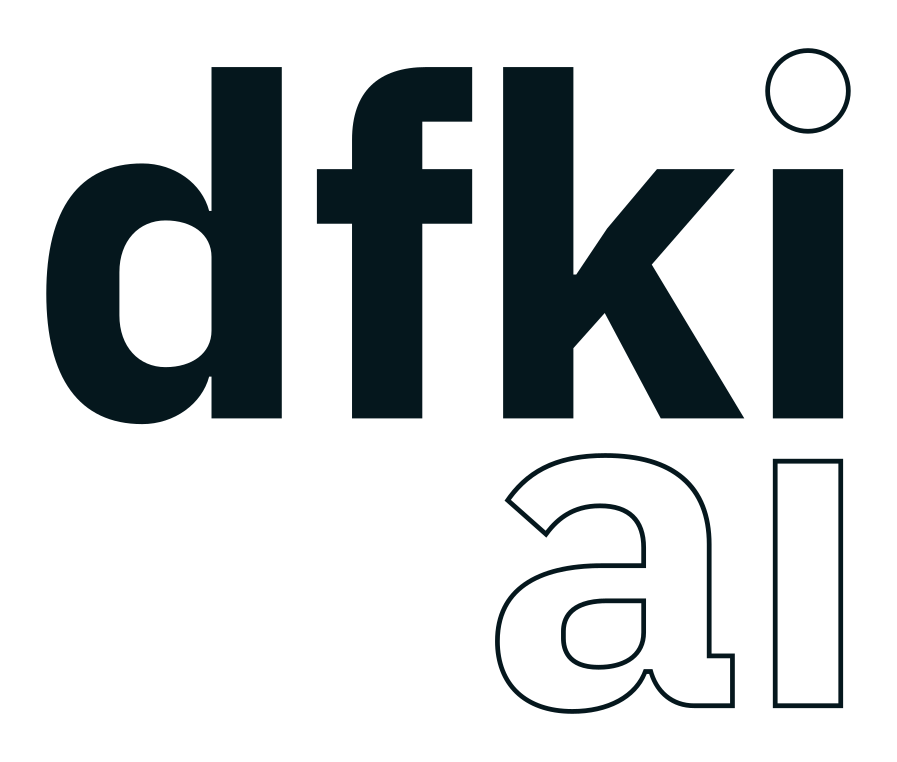
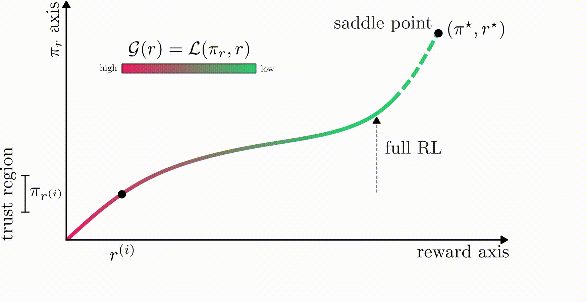
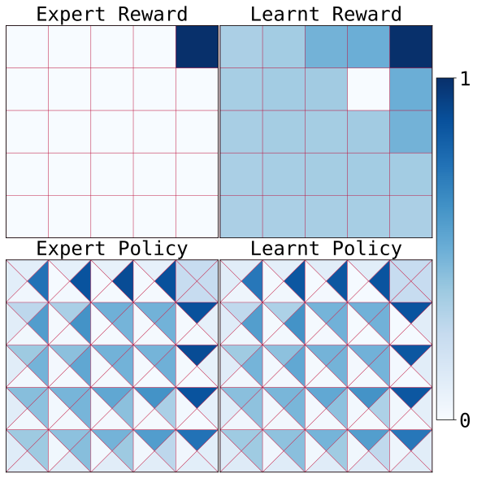

<span>
  &nbsp;&nbsp;
  &nbsp;&nbsp;
  &nbsp;&nbsp;
  &nbsp;&nbsp;
  &nbsp;&nbsp;
  &nbsp;&nbsp;
  
</span>
<br clear="all">

[[`Webpage`](https://anishhdiwan.github.io/trust-region-irl/)] [[`Paper`](https://arxiv.org/pdf/2605.11020)] <br>
Official code release for our **ICML 2026** paper :page_facing_up:<br>
<big><strong>Trust Region Inverse Reinforcement Learning: Explicit Dual Ascent using Local Policy Updates</strong></big><br>
<em><a href="https://anishhdiwan.github.io/">Anish Diwan</a>, <a href="https://www.ias.informatik.tu-darmstadt.de/Team/DavideTateo">Davide Tateo</a>, <a href="https://cmower.github.io/">Christopher E. Mower</a>, <a href="http://bouammar.com/blog/">Haitham Bou-Ammar</a>, <a href="https://www.ias.tu-darmstadt.de/Team/JanPeters">Jan Peters</a>, <a href="https://www.ias.informatik.tu-darmstadt.de/Team/OlegArenz">Oleg Arenz</a></em>

<strong>TL;DR</strong>&ensp;We present an inverse RL method that explicitly optimizes the IRL Lagrangian and it's dual using local trust-region policy updates and a reward correction step. Our key theoretical insight is that a trust-region-optimal policy for a reward update can be globally optimal for a smaller update in the same direction. Our method yields monotonic performance improvement and can learn global reward functions.

<p align="center">
  
  <br>
  <em>TRIRL uses cheap, trust-region policy updates and corrects the reward to account for this local policy optimization.</em>
</p>

> **Note:** This official codebase contains the main method, baselines, and all options used in the paper. This version is intended for reproducibility. A bare-bones version of the algorithm that will be maintained in the long run can be found at [https://github.com/nico-bohlinger/RL-X](https://github.com/nico-bohlinger/RL-X). 

### Install
The following command creates a conda environment and installs this package, the dataset, and its dependencies. For manual installation instructions, please follow [docs/install.md](docs/install.md). We host the dataset on **HuggingFace @ [https://huggingface.co/datasets/anishdiwan/trirl_dataset](https://huggingface.co/datasets/anishdiwan/trirl_dataset)**. 
```bash
./install.sh
```

### Training
<p align="center">
  &emsp;&emsp;
</p>

```bash
cd trust-region-irl/experiments
./run_experiment.sh
```

**Generic Command for Any Algo/Env**
```bash
python experiment.py \
  --algorithm.name="<algorithm>.<implementation>" \
  --algorithm.total_timesteps=xe6 \
  --environment.name="<environment>" \
  --environment.nr_envs=4096 \
  --environment.seed=0 \
  --runner.mode="train" \

  # optional
  --runner.wandb_entity="<wandb>" \
  --runner.project_name="<project>" \
  --runner.exp_name="<exp>" \
```

- **Supported algorithms:** `[trirl_ppo, trirl_trpl, trirl_trpl_fb, gail_ppo, airl_ppo, amp_ppo, near_ppo, lsiq_sac]`. By default pass `flax_full_jit` as the implementation.
  - *Locomujoco implementation*: for robotics, we use the Locomujoco library. Pass `flax_loco_mjx` as the implementation. 
- **Supported environments:** `[half_cheetah_mjx, ant_mjx, walker_mjx, hopper_mjx, humanoid_mjx, loco_mjx]`
  - *Robotics environments:* robotics envs can be accessed by passing `loco_mjx` with the following `[--environment.agent="MjxUnitreeG1" --environment.task="run/walk" , --environment.agent="MjxUnitreeGo2" --environment.task="rl"]`
- The full list of config options of each algorithm is stored in `trust-region-irl/algorithms/<alg_name>/flax_full_jit/default_config.py`


### Discrete Setting
`trust_region_irl_discrete` contains a numpy-only gridworld implementation of TRIRL. It can be used to reproduce Figure 2 in the paper.

```bash
cd trust_region_irl_discrete
python experiment.py # generates .pdf plots
```

<p align="center">
  
</p>

### Cite

```bibtex
@inproceedings{diwan2026trirl,
  title     = {Trust Region Inverse Reinforcement Learning: Explicit Dual Ascent using Local Policy Updates},
  author    = {Diwan, Anish and Tateo, Davide and Mower, Christopher E. and Bou-Ammar, Haitham and Peters, Jan and Arenz, Oleg},
  booktitle = {International Conference on Machine Learning (ICML)},
  year      = {2026},
  url={https://openreview.net/pdf?id=XSYX75R6RC}
}
```